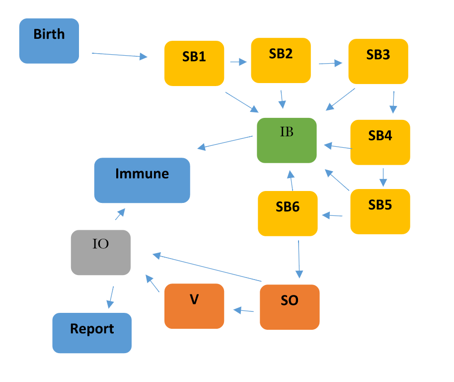

\newcommand\prob{\mathbb{P}}
\newcommand\E{\mathbb{E}}
\newcommand\var{\mathrm{Var}}
\newcommand\cov{\mathrm{Cov}}
\newcommand\loglik{\ell}
\newcommand\R{\mathbb{R}}
\newcommand\data[1]{#1^*}
\newcommand\params{\, ; \,}
\newcommand\transpose{\scriptsize{T}}
\newcommand\eqspace{\quad\quad}
\newcommand\myeq[1]{\eqspace \displaystyle #1}
\newcommand\lik{\mathscr{L}}
\newcommand\loglik{\ell}
\newcommand\profileloglik[1]{\ell^\mathrm{profile}_#1}
\newcommand\ar{\phi}
\newcommand\ma{\psi}
\newcommand\AR{\Phi}
\newcommand\MA{\Psi}
\newcommand\ev{u}
\newcommand\given{{\, | \,}}
\newcommand\equals{{=\,}}
\newcommand\matA{\mathbb{A}}
\newcommand\matB{\mathbb{B}}
\newcommand\matH{\mathbb{H}}
\newcommand\covmatX{\mathbb{U}}
\newcommand\covmatY{\mathbb{V}}

```{r opts,include=FALSE}
library(knitr)
prefix <- "Rubella"
opts_chunk$set(
  progress=TRUE,
  prompt=FALSE,tidy=FALSE,highlight=TRUE,
  strip.white=TRUE,
  warning=FALSE,
  message=FALSE,
  error=FALSE,
  echo=TRUE,
#  cache=TRUE,
  cache=FALSE,
  cache.extra=list(rand_seed,R.version.string),
  results='markup',
  fig.show='asis',
  size='small',
  fig.lp="fig:",
  fig.path=paste0("figure/",prefix,"-"),
  cache.path=paste0("cache/",prefix,"-"),
  fig.pos="h!",
  fig.align='center',
  fig.height=5,fig.width=6.83,
  dpi=300,
  dev='png',
  dev.args=list(bg='transparent')
  )

options(cores=8)

library(ggplot2)
theme_set(theme_bw())

set.seed(594709947L)
require(ggplot2)
require(plyr)
require(reshape2)
require(magrittr)
require(pomp)
stopifnot(packageVersion("pomp")>="0.69-1")
```

--------------------------

Produced with R version `r getRversion()` and **pomp** version `r packageVersion("pomp")`.

--------------------------

## Introduction

* In this project, we are going to study the Rubella cases in Michigan from 1968 to 1980.

* We want build a POMP Rubella models with covariates including demographic data, which consists of birth rates and total population, and seasonality, which consists of babies of each six one-month birth cohorts and individuals who are Rubella vaccinated after six months birth.

* Confirm that people are immune to the future infections of Rubella once they are recover. So that we could build our model based on basic susceptible-infected-recovered (SIR) model. 

* Rubella vaccination was first introduced in 1969, which really helped prevent Rubella. So here, we want to investigate the effect of the vaccination. However, since we do not have the data of vaccinated individuals, we tread it as an unobserved state. 


-------------------------------

## Data

### Data source

* The Rubella cases data in Michigan from 1968 to 1980 is from [Project Tycho Level 1 data](http://www.tycho.pitt.edu/data/level1.php).

* The population size in Michigan is obtained from [United States Census Bureau](http://www.census.gov/en.html).

* The birth rate in Michigan is obtained from [NATIONAL HEALTH FILE, U.S. Health and Medical Data](http://michigan.nationalhealthfile.org/).

* After we download the data, we first do the data cleaning and pre-processing, and then put them into `Rubella_MI.csv`.

### Data description 

* Let's have a brief look of our data first:

```{r data}
Rubella_data = read.csv("Rubella_MI.csv", header=T)
Rubella_data$Time = Rubella_data$Year + (Rubella_data$Month-1)/12
colnames(Rubella_data) = c("year","month","cases","births","pop","time")
head(Rubella_data)
```

* 'cases', the monthly reported Rubella cases in MI;

* 'births', the monthly average recorded births for each year in MI;

* 'pop', the annual census of population in MI;

* 'time', discrete time in years.

-----------------------------------------------

## Model Assumption

* We construct a similar model with the one in [Lecture 18](http://ionides.github.io/531w16/notes18/notes18.html), where we group babies under six months and older than six months. Furthermore, we set up another susceptible state $V$, which represents the individuals who have taken Rubella vaccine.

* [Rubella vaccine](https://en.wikipedia.org/wiki/Rubella_vaccine) starts from 1969 in US. The first dose of Rubella vaccine should be taken from 9 to 12 months of age. We believe the vaccine can make an effect to reduce the desease. So we include it in our model.

* Then, our state vector of the model consists of numbers of individuals each time becomes
$$X(t)=\big(S^B_1(t),...,S^B_6(t), I^B(t),S^O(t),V(t),I^O(t),R(t) \big).$$

* Here, $S^B_1(t),...,S^B_6(t)$ are the susceptible babies in each of six one-month birth cohorts, $I^B(t)$ is the infected babies, $S^O(t)$ is the susceptible older individuals, $V(t)$ is the vaccined susceptible individuals, $I^O$ is the infected older individuals and $R(t)$ is the recovered people with lifelong immunity. 

* The model is graphically represented as follows:


* We prefer the discreter time model here. In the project, we fitted monthly observations from January 1969 to December 1980, so we define
$$t_n=1969+ (n-1)/12,\ n=0,\dots,N$$

* Babies under six months are modeled as fully protected from symptomatic Rubella; older infections lead to reported cases at a rate $\rho$. 

* The mean force of infection, in units of $\mathrm{yr}^{-1}$, is modeled as
$$\bar\lambda_n=\left( \beta_n \frac{I^O_n+I^B_n}{P_n} + \psi \right)$$
where $P_n$ is census population interpolated to time $t_n$.

* Seasonality of transmission is modeled as
$$\beta_n=\exp\left\{ \sum_{k=1}^K b_k\xi_k(t_n) \right\},$$
with $\{\xi_k(t),k=1,\dots,K\}$ being a periodic B-spline basis. We set $K=7$. 

* The force of infection has a stochastic perturbation,
$$\lambda_n = \bar\lambda_n \epsilon_n,$$
where $\epsilon_n$ is a Gamma random variable with mean 1 and variance $\sigma^2_{\mathrm{env}} + \sigma^2_{\mathrm{dem}}\big/\bar\lambda_n$. These two terms capture variation on the environmental and demographic scales, respectively. 

* All compartments suffer a mortality rate, set at $\delta=1/60\mathrm{yr}^{-1}$. Within each month, all susceptible individuals are modeled as having exposure to constant competing hazards of mortality and Rubella infection.  

* The chance of remaining in the susceptible population when exposed to these hazards for one month is therefore
$$p_n = \exp\big\{ -(\delta+\lambda_n)/12\big\},$$
with the chance of Rubella infection being 
$$q_n = (1-p_n)\lambda_n\big/(\lambda_n+\delta).$$

* Writing $B_n$ for births in month $n$, we obtain the dynamic model is:
$$\begin{array}{rcl}
S^B_{1,n+1}&=&B_{n+1}\\
S^B_{k,n+1}&=&p_nS^B_{k-1,n} \quad\mbox{for $k=2,\dots,6$}\\
S^O_{n+1}&=& p_n(S^B_{6,n})\\
V_{n+1} &=& p_n (V_n+S^O_n)\\
I^B_{n+1}&=& q_n \sum_{k=1}^6 S^B_{k,n}\\
I^O_{n+1}&=& q_n (S^O_n + V_n)\\
\end{array}$$

* The model for the reported observations, conditional on the state, is a discretized normal distribution truncated at zero, with both environmental and Poisson-scale contributions to the variance:
$$Y_n= \max\{\mathrm{round}(Z_n),0\}, \quad Z_n\sim\mathrm{normal}\left(\rho I^O_n, \big(\tau  I^O_n\big)^2 + \rho I^O_n\right).$$

* Additional parameters are used to specify initial state values at time $t_0=1969$. 
We will suppose there are parameters $\big(\tilde S^B_{1,0},...,\tilde S^B_{6,0}, \tilde I^B_0,\tilde I^O_0,\tilde S^O_0,\tilde V_0\big)$ that specify the population in each compartment at time $t_0$ via
$$ S^B_{1,0}= {\tilde S}^B_{1,0} ,...,S^B_{6,0}= \tilde S^B_{6,0}, \quad I^B_{0}= P_0 \tilde I^B_{0},\quad S^O_{0}= P_0 \tilde S^O_{0}, \quad I^O_{0}= P_0 \tilde I^O_{0},\quad V_{0}= P_0 \tilde V_{0}.$$

* We assume $\tilde I^B_{0}=0,\tilde V_{0}=0$ and use monthly births in the preceding months (ignoring infant mortality) to fix $\tilde S^B_{k,0}=B_{-1}=Monthly\ Birth\ in\ 1968$ for $k=1,\dots,6$. The estimated initial conditions are then defined by the two parameters $\tilde I^O_{0}$ and $\tilde S^O_{0}$

---------------------

## Building a pomp object for the Rubella model

* Observations are monthly case reports, $y^*_{1:N}$, occurring at times $t_{1:N}$.  We code the state and observation variables, and the choice of $t_0$, as

```{r statenames} 
Rubella_statenames <- c("SB1","SB2","SB3","SB4","SB5","SB6","IB","SO","V","IO")
Rubella_obsnames <- "cases"
Rubella_t0 <- 1969
```

* We do not explictly code $R$, since it is defined implicitly as the total population minus the sum of the other compartments. Due to lifelong immunity, individuals in $R$ play no role in the dynamics.

* Now, let's define the covariates. `time` gives the time at which the covariates are defined. `P` is a smoothed interpolation of the annual census. `B` is monthly births. The B-spline basis is coded as `xi1,...,xi7`

```{r covariates}
Rubella_K <- 7
Rubella_tcovar <- Rubella_data$time
Rubella_bspline_basis <- periodic.bspline.basis(Rubella_tcovar,nbasis=Rubella_K,degree=3,period=1)
colnames(Rubella_bspline_basis)<- paste("xi",1:Rubella_K,sep="")
covartable <- data.frame(
  time=Rubella_tcovar,
  Rubella_bspline_basis,
  B=Rubella_data$births,
  P=predict(smooth.spline(x=1968:1980,y=Rubella_data$pop[12*(1:13)]),
            x=Rubella_tcovar)$y
)
```

* The parameters $b_1,\dots,b_\mathrm{K},\psi,\rho,\tau,\sigma_\mathrm{dem}, \sigma_\mathrm{env}$  in the model above are regular parameters(RPs), coded as

```{r rp_names} 
Rubella_rp_names <- c("b1","b2","b3","b4","b5","b6","b7","psi","rho","tau","sigma_dem","sigma_env")
```

* The parameters $\tilde I^O_{0}$ and  $\tilde S^O_{0}$ is initial value parameters(IVPs), coded as

```{r ivp_names} 
Rubella_ivp_names <- c("SO_0","IO_0")
```

* And the fixed parameters(FPs)

```{r fixed_names} 
Rubella_fp_names <- c("delta","K","SB1_0","SB2_0","SB3_0","SB4_0","SB5_0","SB6_0")
Rubella_paramnames <- c(Rubella_rp_names,Rubella_ivp_names,Rubella_fp_names)
Rubella_fixed_params <- c(delta=1/60,K=Rubella_K,SB1_0=Rubella_data$births[12],
                          SB2_0=Rubella_data$births[11],SB3_0=Rubella_data$births[10],
                          SB4_0=Rubella_data$births[9],SB5_0=Rubella_data$births[8],
                          SB6_0=Rubella_data$births[7])
```

* We read in a table of previous parameter search results from `Rubella_params.csv`, and take the one with highest likelihood as our current estimate of an MLE.

```{r Rubella_read_mle}
Rubella_params <- data.matrix(read.csv("Rubella_params.csv",row.names=NULL,header=TRUE))
Rubella_mle <- c(Rubella_params[which.max(Rubella_params[,"logLik"]),][Rubella_paramnames])
```

* The process model

```{r rprocess}
Rubella_rprocess <- Csnippet("
  double lambda, beta, var_epsilon, p, q;
                           
beta = exp(dot_product( (int) K, &xi1, &b1));
lambda = (beta * (IO+IB) / P + psi);
var_epsilon = pow(sigma_dem,2)/ lambda +  pow(sigma_env,2);
lambda *= (var_epsilon < 1.0e-6) ? 1 : rgamma(1/var_epsilon,var_epsilon);
p = exp(- (delta+lambda)/12);
q = (1-p)*lambda/(delta+lambda);
SB1 = B;
SB2= SB1*p;
SB3=SB2*p;
SB4=SB3*p;
SB5=SB4*p;
SB6=SB5*p;
SO= (SB6)*p;
V = (V+SO)*p;
IB=(SB1+SB2+SB3+SB4+SB5+SB6)*q;
IO=(SO+V)*q;
                           ")
```

* The measurement model:

```{r measure}
Rubella_dmeasure <- Csnippet("
double tol = 1.0e-25;
double mean_cases = rho*IO;
double sd_cases = sqrt(pow(tau*IO,2) + mean_cases);
if(cases > 0.0){
lik = pnorm(cases+0.5,mean_cases,sd_cases,1,0) - pnorm(cases-0.5,mean_cases,sd_cases,1,0) + tol; 
} else{
lik = pnorm(cases+0.5,mean_cases,sd_cases,1,0) + tol;
}
if (give_log) lik = log(lik);
                           ")


Rubella_rmeasure <- Csnippet("
  cases = rnorm(rho*IO, sqrt( pow(tau*IO,2) + rho*IO ) );
if (cases > 0.0) {
cases = nearbyint(cases);
} else {
cases = 0.0;
}
                           ")
```

* The initializer function:

```{r initializer}
Rubella_initializer <- Csnippet("
  SB1 = SB1_0;
  SB2 = SB2_0;
  SB3 = SB3_0;
  SB4 = SB4_0;
  SB5 = SB5_0;
  SB6 = SB6_0;
  IB = 0;
  V = 0;
  IO = IO_0 * P;
  SO = SO_0 * P;
                              ")
```

* Transformations:

```{r trans}
Rubella_toEstimationScale <- Csnippet("
 Tpsi = log(psi);
 Trho = logit(rho);
 Ttau = log(tau);
 Tsigma_dem = log(sigma_dem);
 Tsigma_env = log(sigma_env);
 TSO_0 =  logit(SO_0);
 TIO_0 = logit(IO_0);
                                    ")

Rubella_fromEstimationScale <- Csnippet("
 Tpsi = exp(psi);
 Trho = expit(rho);
 Ttau = exp(tau);
 Tsigma_dem = exp(sigma_dem);
 Tsigma_env = exp(sigma_env);
 TSO_0 =  expit(SO_0);
 TIO_0 = expit(IO_0);
                                      ")
```

* We can now build a pomp object:

```{r pomp}
Rubella <- pomp(
  data=subset(Rubella_data, 
              (time > Rubella_t0 + 0.01) & (time < 1980+11/12+0.01),	
              select=c("cases","time")),
  times="time",
  t0=Rubella_t0,
  params=Rubella_mle,
  rprocess = euler.sim(step.fun = Rubella_rprocess, delta.t=1/12),
  rmeasure= Rubella_rmeasure,
  dmeasure = Rubella_dmeasure,
  covar=covartable,
  tcovar="time",
  obsnames = Rubella_obsnames,
  statenames = Rubella_statenames,
  paramnames = Rubella_paramnames,
  covarnames = c("xi1","B","P"),
  initializer=Rubella_initializer,
  toEstimationScale=Rubella_toEstimationScale, 
  fromEstimationScale=Rubella_fromEstimationScale
)
plot(Rubella)
```


---------------

## Setting run levels

* As usual, we set 3 different run levels for different steps of our project.

```{r run_level}
run_level = 3
Rubella_Np <-          c(100,5e3,1e4)
Rubella_Nmif <-        c(10, 200,300)
Rubella_Nreps_eval <-  c(2,  10,  20)
Rubella_Nreps_local <- c(10, 10, 40)
Rubella_Nreps_global <-c(10, 10, 80)
Rubella_Nsim <-        c(50,100, 500) 
```

-------------------

## Likelihood evaluation at an estimated MLE

* Let's find out a likelihood evaluation at an estimated MLE.

```{r parallel-setup,cache=FALSE}
require(doParallel)
registerDoParallel()
```

```{r pf1}
stew(file=sprintf("pf1-%d.rda",run_level),{
  t1 <- system.time(
    pf1 <- foreach(i=1:20,.packages='pomp',
                   .options.multicore=list(set.seed=TRUE)) %dopar% try(
                     pfilter(Rubella,Np=Rubella_Np[run_level])
                   )
  )
},seed=493536993,kind="L'Ecuyer")
(L1 <- logmeanexp(sapply(pf1,logLik),se=TRUE))
```

* In  `r round(t1["elapsed"],1)` seconds, we obtain an unbiased likelihood estimate of `r round(L1[1],2)` with a standard error of `r round(L1[2],2)`.

-------------------------

## Simulation to investigate the fitted model: Local persistence

* We can simulate the fitted model to analyze its statistical properties.

* Here, we may be interested in how often months with no reported deseases, correspond to months without any local asymptomatic cases. This could be defined for our model as $I^B_n+I^O_n<1/2$.

```{r persistence}
stew(sprintf("persistence-%d.rda",run_level),{
  t_sim <- system.time(
    sim <- foreach(i=1:Rubella_Nsim[run_level],.packages='pomp',
                   .options.multicore=list(set.seed=TRUE)) %dopar% 
      simulate(Rubella)
  )
},seed=493536993,kind="L'Ecuyer")

no_cases_data <- sum(obs(Rubella)==0)
no_cases_sim <- sum(sapply(sim,obs)==0)/length(sim)
fadeout1_sim <- sum(sapply(sim,function(Ru)states(Ru)["IB",]+states(Ru)["IO",]<1))/length(sim)
fadeout100_sim <- sum(sapply(sim,function(Ru)states(Ru)["IB",]+states(Ru)["IO",]<100))/length(sim)
imports_sim <- coef(Rubella)["psi"]*mean(sapply(sim,function(Ru) mean(states(Ru)["V",]+states(Ru)["SO",]+states(Ru)["SB1",]+states(Ru)["SB2",]+states(Ru)["SB3",]+states(Ru)["SB4",]+states(Ru)["SB5",]+states(Ru)["SB6",])))/12
```

* From the simulation results, we can see the mean of `r round(no_cases_sim,1)` months with no reported cases, while the in real data there were `r no_cases_data` months. Months without asyptomatic infections were on average `r round(fadeout1_sim,1)` months per simulation. Months with less than 100 infections averged `r round(fadeout100_sim,1)` per simulation, where the reporting rate is `r signif(coef(Rubella)["rho"],3)`. For our model, the mean monthly infections caused by importations is `r round(imports_sim,1)`.

* We can also look at the simulation plots of the fitted model:

```{r plot_simulated}
mle_simulation <- simulate(Rubella,seed=127)
plot(mle_simulation)
```

* We see here the prediction data from the fitted model looks not very similar to the real data except the peak around 1978.

* The numbers of vaccinated susceptible individuals in mostly increasing. The reduced case happens in 1977-1978, which can be explained by the increasing of initial recoverd population ($R$). We can also tell there are much less cases of Rubella infection after 1978 because of the prevail of Rubella vaccine.


-----------------


## Local likelihood maxinization with IF2

* We use the iterated filtering algorithm IF2 to improve on the previous MLE.

```{r mif}
Rubella_rw.sd_rp <- 0.02
Rubella_rw.sd_ivp <- 0.2
Rubella_cooling.fraction.50 <- 0.5

stew(sprintf("mif-%d.rda",run_level),{
  t2 <- system.time({
    m2 <- foreach(i=1:Rubella_Nreps_local[run_level],
                  .packages='pomp', .combine=c,
                  .options.multicore=list(set.seed=TRUE)) %dopar% try(
                    mif2(Rubella,
                         Np=Rubella_Np[run_level],
                         Nmif=Rubella_Nmif[run_level],
                         cooling.type="geometric",
                         cooling.fraction.50=Rubella_cooling.fraction.50,
                         transform=TRUE,
                         rw.sd=rw.sd(
                           b1=Rubella_rw.sd_rp,
                           b2=Rubella_rw.sd_rp,
                           b3=Rubella_rw.sd_rp,
                           b4=Rubella_rw.sd_rp,
                           b5=Rubella_rw.sd_rp,
                           b6=Rubella_rw.sd_rp,
                           b7=Rubella_rw.sd_rp,
                           psi=Rubella_rw.sd_rp,
                           rho=Rubella_rw.sd_rp,
                           tau=Rubella_rw.sd_rp,
                           sigma_dem=Rubella_rw.sd_rp,
                           sigma_env=Rubella_rw.sd_rp,
                           IO_0=ivp(Rubella_rw.sd_ivp),
                           SO_0=ivp(Rubella_rw.sd_ivp)
                         )
                    )
                  )
    
    lik_m2 <- foreach(i=1:Rubella_Nreps_local[run_level],.packages='pomp',
                      .combine=rbind,.options.multicore=list(set.seed=TRUE)) %dopar% 
                      {
                        logmeanexp(
                          replicate(Rubella_Nreps_eval[run_level],
                                    logLik(pfilter(Rubella,params=coef(m2[[i]]),Np=Rubella_Np[run_level]))
                          ),
                          se=TRUE)
                      }
  })
},seed=318817883,kind="L'Ecuyer")

r2 <- data.frame(logLik=lik_m2[,1],logLik_se=lik_m2[,2],t(sapply(m2,coef)))
summary(r2$logLik, digits=5)
```

* This investigation took  `r round(t2["elapsed"]/60,1)` minutes.

```{r pairs}
pairs(~logLik+psi+rho+tau+sigma_dem+sigma_env,data=subset(r2,logLik>max(logLik)-100))
```

-------------------

## Global likelihood maximization

* IF2 estimation involves using different starting values for the parameters. We can construct a large box in parameter space containing all plaussible parameter vectors. If the estimation gives a stable performance with different staring values, we could be confidenct that it is an adequate global optimization.

* For our Rubella model, a box containing reasonable parameter values could be

```{r box}
Rubella_box <- rbind(
  b1=c(-2,8),
  b2=c(-2,8),
  b3=c(-2,8),
  b4=c(-2,8),
  b5=c(-2,8),
  b6=c(-2,8),
  b7=c(-2,8),
  psi=c(0,0.05),
  rho=c(0,0.5),
  tau=c(0,0.1),
  sigma_dem=c(0,0.5),
  sigma_env=c(0,2),
  SO_0=c(0,1),
  IO_0=c(0,0.01)
)
```

* We then carry out a search identical to the local one except for the starting parameter values.

```{r box_eval}
stew(file=sprintf("box_eval-%d.rda",run_level),{
  t3 <- system.time({
    m3 <- foreach(i=1:Rubella_Nreps_global[run_level],.packages='pomp',.combine=c,
                  .options.multicore=list(set.seed=TRUE)) %dopar%  
      mif2(
        m2[[1]],
        start=c(apply(Rubella_box,1,function(x)runif(1,x[1],x[2])),Rubella_fixed_params)
      )
    
    lik_m3 <- foreach(i=1:Rubella_Nreps_global[run_level],.packages='pomp',.combine=rbind,
                      .options.multicore=list(set.seed=TRUE)) %dopar% {
                        set.seed(87932+i)
                        logmeanexp(
                          replicate(Rubella_Nreps_eval[run_level],
                                    logLik(pfilter(Rubella,params=coef(m3[[i]]),Np=Rubella_Np[run_level]))
                          ), 
                          se=TRUE)
                      }
  })
},seed=290860873,kind="L'Ecuyer")


r3 <- data.frame(logLik=lik_m3[,1],logLik_se=lik_m3[,2],t(sapply(m3,coef)))
if(run_level>1) write.csv(rbind(r2,r3),file="Rubella_params.csv",row.names=FALSE)
summary(r3$logLik,digits=5)
```

* This search took `r round(t3["elapsed"]/60,1)` minutes, and gives a best result of likelihood of `r round(max(r3$logLik),1)` with a standard error of `r round(r3$logLik_se[which.max(r3$logLik)],1)`.

* We see the result in here is similar with the local likelihood maximization, which gives us confidence of our MLE.

* Let's look at the global searches of parameter estimates:

```{r pairs_global}
pairs(~logLik+psi+rho+tau+sigma_dem+sigma_env,data=r3)
```

* There is one extremly outlier for $\psi$.

-------------------


## Diagnosing success or failure of the maximization procedure

* Let's look at the diagnostics plot. One thing to be noticed is that we just consider the 'mif' diagnostic plot without filtering diagnostics for the last iteration. So we call 'plot' on 'm3', which is of class 'mifList', instead of 'm3[[1]]' which is of class 'mif2d.pomp'.

```{r mif_diagnostics}
class(m3)
class(m3[[1]])
plot(m3[r3$logLik>mean(r3$logLik)])
```

* There is one extremly outlier for $\psi$, which is corresponding to the blue line in the diagnostic plots. But the likelihood for it has no big problem.

* After trying many 'cooling.fraction.50' and 'rw.sd' values, we find this might be a comparable good result. But still the "freezeing" speed is too fast, evidenced by flat paraller lines in the convergence diagnostics. If time plausible, we could try bigger 'rw.sd' and smaller 'cooling.fraction.50' with more iterations in IF2 algorithm. 

* Furthermore, we should focus more on the likelihood. Although the parameter estimates could be unstable, this may not be a serious scientific flaw considering what kind of question you want to answer using the assumed model. As long as the search is converging to the maximum likelihood region, we can be confidence of our MLE works.

* So, let's have a more deeply look at the likelihood convergence:

```{r likelihood_convergence}
loglik_convergence <- do.call(cbind,conv.rec(m3[r3$logLik>mean(r3$logLik)],"loglik"))
matplot(loglik_convergence,type="l",lty=1,ylim=max(loglik_convergence,na.rm=T)+c(-200,0))
```


----------------------------

## Conclusion and further discussion

* We build a POMP Rubella models with covariates including demographic data, which are birth rates and total population, and seasonality, which consists of babies of each six one-month birth cohorts and individuals who are Rubella vaccinated after six months birth.

* From the simulation we can see, there were large epidemics of Rubella before 1978. And after 1978, the cases of infections began to decrease. This could be explained by the prevail of the Rubella vaccination.

* We are confident with our MLE and the likelihoods. Although some estimates of the parameters are still not stable enough, we can continue IF2 algorithm with more iterations and slower 'freezing' speed in the next time.

* For future works, one can consider about the second dose of vaccination and build a model with one more unobserved vaccinated states as another covariate. Besides, reconsider the chance of remaining in the susceptible population between the transmission of each state, since the first dose of vaccination should be taken between 9 - 12 months old and 4 or more years later for the second dose, which are not time-homogenious, one can make some change of the parameter of remaining susceptible chance, $p_n = \exp\big\{ -(\delta+\lambda_n)/12\big\}$.


------------------------------

## References

Lecture notes of STATS 531 by professor Edward Ionides:

* Practical likelihood-based inference for POMP models. [Lecture 13](http://ionides.github.io/531w16/notes13/notes13.html)

* Time series models with covariates, and a case study of polio. [Lecture 18](http://ionides.github.io/531w16/notes18/notes18.html)


-----------------------------
